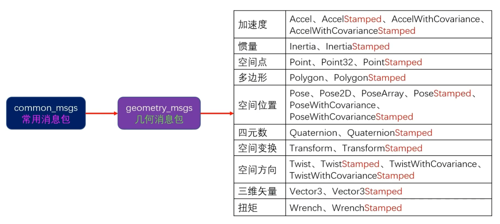

# 启动Cat_kin

```shell
mkdir catkin_ws
cd catkin_ws
mkdir src
cd src
git clone https://github.com/6-robot/wpr_simulation.git
cd wpr_simulation/scripts
./install_for_noetic.sh
cd ~/catkin_ws
catkin_make
vim ~/.bashrc
source ~/caktin_ws/devel/setup.bash
cd ~/catkin_ws/src
git clone https://github.com/6-robot/wpb_home.git
cd wpb_home/wpb_home_bringup/scripts
./install_for_noetic.sh
source ~/caktin_ws/devel/setup.bash
cd ~/catkin_ws
catkin_make
code
# Add Folder to Workspace
# Add src
```

## msckf_vio

```shell
# https://ltslam-doc.readthedocs.io/en/latest/msckf/msckf.html
cd ~/catkin_ws/src
git clone https://github.com/KumarRobotics/msckf_vio.git
cd ..
sudo apt-get install libsuitesparse-dev
sudo apt-get install ros-noetic-random-numbers
echo $CMAKE_PREFIX_PATH
source /opt/ros/noetic/setup.bash
source ~/catkin_ws/devel/setup.bash
catkin_make --pkg msckf_vio --cmake-args -DCMAKE_BUILD_TYPE=Release
# http://robotics.ethz.ch/~asl-datasets/ijrr_euroc_mav_dataset/vicon_room1/V1_01_easy/V1_01_easy.bag
# EuRoC
roslaunch msckf_vio msckf_vio_euroc.launch
# rosbag
rosbag play ~/catkin_ws/data/V1_01_easy.bag
# RVIZ load msckf_vio/rviz/rviz_euroc_config.rviz
rivz # or roslaunch msckf_vio demo.launch
```

+ cd :~/code/catkin_ws/src/wpr_simulation/scripts
+ ./install_for_noetic.sh
+ catkin_make
+ source /home/gym/code/catkin_ws/devel/setup.bash
+ roslaunch wpr_simulation wpb_simple.launch
<!-- + conda env: pip install rospkg -->
+ sudo apt install ros-noetic-teb-local-planner
+ cd /home/gym/code/catkin_ws/src/wpb_home/wpb_home_bringup/scripts
+ ./install_for_noetic.sh

## Cmake demo

```Makefile
add_executable(lidar_node src/lidar_node.cpp)
add_dependencies(lidar_node ${${PROJECT_NAME}_EXPORTED_TARGETS} ${catkin_EXPORTED_TARGETS})
target_link_libraries(lidar_node
  ${catkin_LIBRARIES}
)
```

## waypoint tools

```bash
roslaunch waterplus_map_tools add_waypoint_simulation.launch
rosrun waterplus_map_tools wp_saver
```

## 速度控制

rosrun rqt_robot_steering rqt_robot_steering

## 在WSL中添加代理

```bash
git config --global user.name Star-Cheng
git config --global user.email 133592901@qq.com
git config --global http.proxy http://127.0.0.1:7890
git config --global https.proxy https://127.0.0.1:7890
```

## Terminator

+ sudo apt install terminator
+ ctrl+shift+E, ctrl+shift+O

## Node(节点)

1. 使用catkin_create_pkg创建一个软件包
2. 在软件包的src文件夹下创建一个节点的cpp源码文件
3. 在节点的源码文件中include包含ROS的头文件
4. 构建一个main函数, 并在函数的开头执行ros::inti()
5. 构建while循环, 循环条件为ros::ok
6. 在CMakeLists.txt中设置节点源码的编译规则
7. 编译运行

## Topic(话题)

1. 一个ROS节点网络中, 可以同时存在**多个**话题
2. 一个话题可以有**多个**发布者, 也可以有多个订阅者
3. 一个节点可以对**多个**话题进行订阅, 也可以发布**多个**话题
4. 不同的**传感器**小气通常会拥有**各自独立**话题名称, 每个话题只有**一个**发布者
5. 机器人**速度指令话题通**常会有多个发布者, 但是同一时间只能有一个发言人

## Message(消息)

1. 确定**话题名称**和**消息类型**
2. 在代码文件中include**消息类型**对应的**头文件**
3. 在main函数中**通过NodeHandler**大管家**发布**一个话题并得到消息发送对象
4. **生成**要发送的**消息包**并进行发送数据的**赋值**
5. 调用消息发送对象的**publish()函数**将消息包**发送**到话题当中
6. 常用工具
    1. rostopic list
        + 列出当前系统中所有活跃着的话题
    2. rostopic echo 主题名称
        + 显示指定话题中发送的消息包内容
    3. rostopic hz 主题名称
        + 统计指定话题中消息包发送频率
    4. rqt_graph
        + 图像化显示当前系统活跃的节点以及节点间的话题通讯关系

## Subscriber(订阅者)

1. 确定**话题名称**和**消息类型**
2. 在代码文件中include**消息类型**对应的**头文件**
3. 在main函数中**通过NodeHandler**大管家**订阅**一个话题并得到消息订阅对象
4. 定义一个**回调函数**，对接收到的**消息包**进行处理
5. main函数中需要执行**ros::spinOnce()**, 让回调函数能够响应接收到的消息包
6. 常用工具
    1. rqt_graph
        + 图像化显示当前系统活跃的节点以及节点间的话题通讯关系

## launch文件启动节点

1. 使用lauch文件, 可以通过roslaunch指令一次启动多个节点
2. 在launch文件中, 为节点添加output="screen"属性, 可以让节点信息输出在终端中(ROS_WARN不受改属性控制)
3. 在launch文件中, 为节点添加launch-prefix="gnome-terminal -e"属性, 可以让节点运行在一个独立的终端中

```xml
<launch>
    <node pkg= "ssr_pkg" type="yao_node" name="yao_node"/>
    <node pkg= "ssr_pkg" type="chao_node" name="chao_node" launch-prefix="gnome-terminal -e"/>
    <node pkg= "atr_pkg" type="ma_node" name="ma_node" output="screen"/>
</launch>
```

## ROS消息包





### 生成自定义消息包

1. 创建新软件包, 依赖项: **message_generation**, **message_runtime**
2. 软件包添加**msg**目录, 新建自定义消息文件, **以.msg结尾**
3. 在CMakeLists.txt中, 将**新建的.msg文件**加入到**add_messages_files()**
4. 在CMakeLists.txt中, 去掉**generate_messages()**注释符号, 将依赖的其他消息包名添加进去
5. 在CMakeLists.txt中, 将**message_runtime**加入**catkin_package()**的**CATKIN_DEPENDS**
6. 在package.xml中, 将message_runtime加入<build_depend>, <exec_depend>
7. 编译软件包, 生成新的自定义消息类型
8. 使用**rosmsg show package_name/message_name**, 查看自定义消息类型

### 新消息类型在C++节点的应用

1. 在节点代码中, 先include自定义消息类型的头文件
2. 在发布或订阅话题的时候, 将话题中的消息类型设置为新的消息类型
3. 按照新的消息结构, 对消息包进行赋值发送或读取解析
4. 在CMakeLists.txt文件的find_package()中, 添加新消息名称作为依赖项
5. 在节点的编译规则中, 添加一条add_dependencies(), 将新消息软件包名称_generate_messages_cpp作为依赖项
6. 在package.xml文件中, 将新消息软件包名称加入<build_depend>, <exec_depend>
7. 运行catkin_make, 编译新消息软件包

### 新消息类型在Python节点的应用

1. 在节点代码中, 先import自定义消息类型的模块
2. 在发布或订阅话题的时候, 将话题中的消息类型设置为新的消息类型
3. 按照新的消息结构, 对消息包进行赋值发送或读取解析
4. 在CMakeLists.txt文件的find_package()中, 添加新消息包名称作为依赖项
5. 在package.xml文件中, 将新消息包名称加入<build_depend>, <exec_depend>
6. 重写编译, 确保软件包进入ROS的包列表中

## ROS中的相机话题

1. /image_raw: 相机的原始数据
2. /image_color: 相机的彩色图像数据
3. /image_color_rect: 畸变校正后的彩色图像数据
4. /camera_info: 相机参数信息
